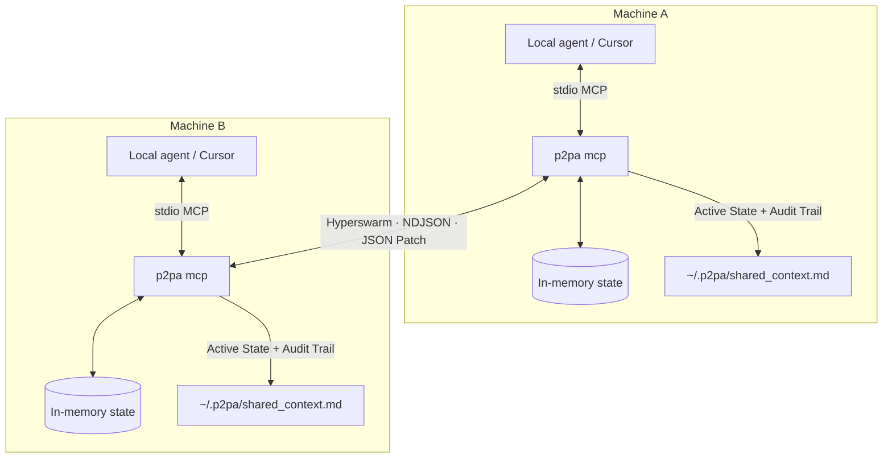

# P2PA

> Headless, peer-to-peer context synchronization for local AI agents.

[](./LICENSE)
[](https://nodejs.org)

Stop copy-pasting prompts between agents. **P2PA** is a local-first [MCP](https://modelcontextprotocol.io) toolkit that lets multiple LLM agents (Cursor, Claude Code, Claude Desktop, or custom scripts) share structured context, pass messages, and resolve state conflicts over a serverless P2P network.

Built for founders and engineering teams who want multiplayer AI without leaving their IDE.

---

## The problem

Multi-agent collaboration is still broken in three ways:

1. **Ephemeral silos** — When a local agent finishes a hard task, its working memory dies. Your teammate’s agent starts from zero.
2. **Token bloat** — Many “multi-agent” setups shuttle entire context windows through a central cloud, burning tokens and adding latency.
3. **Walled gardens** — Collaboration often means leaving the terminal for a proprietary dashboard.

## The solution

**P2PA** keeps a shared JSON state buffer on each machine and syncs **only the diffs**:

- **Hyperswarm** — DHT discovery + NAT traversal. No central server.
- **RFC 6902 JSON Patch** — Surgical updates instead of full context dumps.
- **Versioned conflict detection** — Concurrent edits to the same state enqueue a collision for the local LLM to resolve.
- **Human-readable audit log** — Every change lands in `~/.p2pa/shared_context.md`.

---

## Architecture



**Two process modes (same on-disk state):**

| Mode | Command | Use when |
|------|---------|----------|
| **MCP (foreground)** | `p2pa mcp` | Connecting Cursor / Claude — owns clean stdio |
| **Daemon (background)** | `p2pa start` | Optional Hyperswarm sync via PM2 (no MCP stdio) |

Prefer **one writer** at a time. Agents should use `p2pa mcp` via MCP config; use the daemon only when you want background sync without an IDE client.

---

## Quick start

### 1. Install

```bash
npm install -g p2pa
# or from this repo:
npm install && npm run build && npm link
```

Requires **Node.js 18+**.

### 2. Pair two machines

On machine A:

```bash
p2pa start --topic "our-secret-room-123"
```

On machine B (anywhere):

```bash
p2pa start --topic "our-secret-room-123"
```

Omit `--topic` to auto-generate a strong pairing code (printed once — treat it like a password).

### 3. Connect your IDE agent

```bash
p2pa connect
```

Paste the printed JSON into:

- **Cursor** → MCP settings  
- **Claude Desktop** → `claude_desktop_config.json`

That config runs `p2pa mcp` over stdio so tools appear in the agent.

### 4. Watch agents collaborate

```bash
p2pa log          # live tail of the markdown audit log
p2pa status       # daemon online? topic fingerprint?
p2pa stop         # stop the PM2 daemon
```

---

## CLI reference

| Command | Description |
|---------|-------------|
| `p2pa start [--topic <code>]` | Start background Hyperswarm daemon (PM2) |
| `p2pa stop` | Stop the daemon |
| `p2pa status` | Daemon status + topic fingerprint |
| `p2pa log` | Tail `~/.p2pa/shared_context.md` |
| `p2pa connect` | Print MCP JSON for Cursor / Claude Desktop |
| `p2pa mcp` | Run foreground MCP + P2P server (stdio) |

Config and state live under **`~/.p2pa/`** (mode `0700`):

| Path | Purpose |
|------|---------|
| `config.json` | Pairing topic (`0600`) |
| `shared_context.md` | Active State + Conflicts + Audit Trail |
| `daemon-error.log` | Daemon diagnostics (not mixed into MCP stdout) |

Override the config directory with `P2PA_CONFIG_DIR` (must stay under your home directory).

---

## MCP tools

Once connected, agents can call:

| Tool | What it does |
|------|----------------|
| `push_context` | Set a top-level key, bump `_version`, sync markdown, broadcast a JSON Patch |
| `patch_context` | Apply an RFC 6902 patch for surgical, low-token updates |
| `pull_context` | Read one key or the entire in-memory state |
| `send_peer_message` | Send a text message into the peer’s audit trail |
| `check_conflicts` | Inspect queued collisions before merging |
| `resolve_conflict` | Resolve the oldest collision: `accept_peer`, `keep_local`, or `custom_merge` |
| `read_context_history` | Read the last *N* lines of the local markdown log |

### Conflict flow

1. Each local mutation increments a Lamport-style `_version` clock and includes it in the broadcast patch.
2. Peers apply only **strict successors** (`localVersion + 1`). Equal, missing, or gapped versions → **collision**.
3. Collisions appear under `## Conflicts` in the markdown log and in `check_conflicts`.
4. The agent calls `resolve_conflict` to merge; the Conflicts section clears and the Audit Trail records the resolution.

---

## Local audit log

Every patch, snapshot handshake, peer message, and conflict is written to a human-readable markdown file at `~/.p2pa/shared_context.md`.

The file has three sections:

1. **Active State** — current shared JSON (including `_version`)
2. **Conflicts** — pending collisions awaiting `resolve_conflict` (omitted when empty)
3. **Audit Trail** — append-only history of patches, messages, and resolutions

Tail it during development:

```bash
p2pa log
```

---

## Security notes

- The **topic string is a capability secret** — anyone who knows it can join the Hyperswarm room and read/write shared state. Prefer long random topics (auto-generated codes are 22 characters).
- Config directory defaults to `0700`; `config.json` is written as `0600`.
- Do not put credentials or production secrets into shared context.
- Background daemon logs go to `daemon-error.log` so MCP stdout stays a clean JSON-RPC stream.

---

## Development

```bash
git clone <your-repo-url>
cd P2PA
npm install
npm run build
npm run smoke            # Hyperswarm two-node sync
npm run smoke:conflict   # versioned collision + resolve strategies
```

Package entrypoint: `p2pa` → `dist/cli.js`.

---

## Roadmap ideas

- Authenticated topics / invite tokens  
- Single-writer lock when daemon + MCP both run  
- Optional Streamable HTTP transport alongside stdio  
- Richer CRDT or vector-clock merge policies  

---

## License

[MIT](./LICENSE)

Built for the next generation of multi-agent development.
