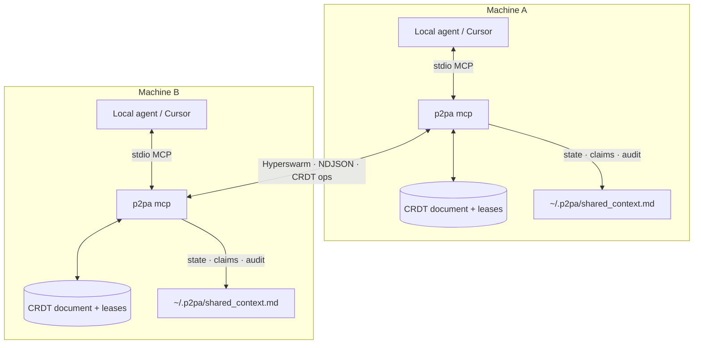

# P2PA

> Headless, peer-to-peer context synchronization for local AI agents.

[](./LICENSE)
[](https://nodejs.org)

Stop copy-pasting prompts between agents. **P2PA** is a local-first [MCP](https://modelcontextprotocol.io) toolkit that lets multiple LLM agents (Cursor, Claude Code, Claude Desktop, or custom scripts) share structured context, pass messages, and merge concurrent edits over a serverless P2P network.

Built for founders and engineering teams who want multiplayer AI without leaving their IDE.

---

## The problem

Multi-agent collaboration is still broken in three ways:

1. **Ephemeral silos** — When a local agent finishes a hard task, its working memory dies. Your teammate’s agent starts from zero.
2. **Token bloat** — Many “multi-agent” setups shuttle entire context windows through a central cloud, burning tokens and adding latency.
3. **Walled gardens** — Collaboration often means leaving the terminal for a proprietary dashboard.

## The solution

**P2PA** keeps a shared JSON state buffer on each machine and syncs **only the diffs**:

- **Hyperswarm** — DHT discovery + NAT traversal. No central server.
- **Key-based peer authentication** — Only allowlisted ed25519 keys can connect. No inbound access from a leaked topic.
- **Per-key CRDT merge** — Every key carries its own hybrid logical clock. Two agents writing different keys never conflict; two agents writing the same key resolve to the same winner on every replica, with no arbitration step.
- **Add-wins sets** — Concurrent appends to a list all survive, instead of one agent's entries overwriting the other's.
- **Work-claiming leases** — An agent claims a task before starting it, so two connected agents don't duplicate work. Leases expire on their own, so a crashed agent cannot block the backlog.
- **Agent roster** — Each agent publishes its role, capabilities and status, so a swarm can route work to whoever is actually free instead of guessing.
- **Addressed messages** — Ask one specific agent a question and match its reply by correlation id, rather than broadcasting at everyone.
- **Signed operations** — Every write is signed by its author's key, so an entry stays attributable after any number of peers relay it. Without this, a swarm of three lets one peer fabricate another's writes.
- **Negotiated protocol** — Peers agree a version and capability set on connect, so a mixed-version swarm keeps working and an incompatible one says why instead of silently never syncing.
- **Event-driven, not polling** — An agent can block until the other one actually does something, instead of hoping it remembers to check.
- **Messages survive a disconnect** — Write to a peer whose agent is offline and it is delivered when they return. Nobody has to resend.
- **Human-readable audit log** — Every change lands in `~/.p2pa/shared_context.md`, attributed to the peer that made it.

The wire protocol is specified in **[SPEC.md](./SPEC.md)** — frame grammar, merge
rules, signature canonicalization, bounds, and conformance vectors — so P2PA can
be implemented in another language and interoperate.

---

## Architecture



**Two process modes (same on-disk state):**

| Mode | Command | Use when |
|------|---------|----------|
| **MCP (foreground)** | `p2pa mcp` | Connecting Cursor / Claude — owns clean stdio |
| **Daemon (background)** | `p2pa start` | Optional Hyperswarm sync via PM2 (no MCP stdio) |

**Run one, not both.** Both modes write the same files, so P2PA takes a writer
lock at startup and the second one exits with an explanation rather than
quietly overwriting the first. Use `p2pa mcp` when an IDE agent is driving;
use the daemon when you want background sync without one.

---

## Try it in two minutes (one machine)

No pairing, no second computer — this just proves the merge engine and the
work-leases do what they claim:

```bash
git clone https://github.com/SanjoyDat1/P2PA.git
cd P2PA
npm install
npm test                 # full suite, fully offline

npm run smoke:merge      # two replicas writing at once, no lost work
npm run smoke:claim      # two agents racing one backlog, nobody duplicates
npm run smoke:outbox     # a message left for an agent that is offline
```

`npm test` needs no network: the peer-authentication tests run a real
`hyperdht` testnet in-process.

---

## Running it for real (two machines)

### 1. Install

```bash
npm install -g p2pa
```

Or from a clone:

```bash
npm install && npm run build && npm link
```

Requires **Node.js 18+**. Everything lives in `~/.p2pa/`.

### 2. Pair the two machines

Pairing is **mutual and key-based**. Each side allowlists the other's public
key, and only allowlisted keys can connect — knowing the topic is not enough.

On machine **A**:

```bash
p2pa pair                 # prints an invite token
```

Send that token to **B** over a channel you already trust (it carries the
pairing topic, so treat it like a password).

On machine **B**:

```bash
p2pa pair <A's token>     # allowlists A, adopts A's topic, prints B's token
```

Back on **A**:

```bash
p2pa pair <B's token>     # allowlists B — pairing complete
p2pa peers                # confirm both directions
```

Then lock it down (this is the default for new installs, but check):

```bash
p2pa auth strict
```

### 3. Point your agent at it

```bash
p2pa connect
```

That prints a ready-made MCP server block. Paste it into:

- **Claude Code** — `claude mcp add p2pa -- p2pa mcp`, or the printed JSON in `.mcp.json`
- **Cursor** — Settings → MCP
- **Claude Desktop** — `claude_desktop_config.json`

The config runs `p2pa mcp` over stdio, so the tools appear inside the agent.

### 4. Choose one process, not two

| You want | Run | Notes |
|---|---|---|
| An IDE agent driving it | `p2pa mcp` (via the MCP config above) | Started for you by the client |
| Background sync, no IDE | `p2pa start` | PM2 daemon |

Both write the same files, so P2PA takes a **writer lock** at startup: whichever
starts second exits with an explanation instead of silently overwriting the
first. If you get that message, `p2pa stop` the daemon and retry.

### 5. Watch it work

```bash
p2pa status        # identity, topic, auth mode, peer count
p2pa log           # live tail of the audit trail
p2pa peers         # who you are paired with
p2pa stop          # stop the daemon
```

---

## What a session actually looks like

Two developers, two machines, one backlog. Nothing here is manual bookkeeping —
the agents do it through the tools.

**Agent A** picks up work and says so:

```
claim_task("refactor-auth", note: "splitting the token module")
push_context("status", "auth refactor started")
```

**Agent B**, on the other machine, checks before starting anything:

```
list_claims()            → refactor-auth is held by a3f9c1b2
claim_task("write-tests") → granted, different task
```

**Agent B** finishes and goes idle, rather than polling:

```
release_task("write-tests")
await_peer_event()       → blocks…
                         ← { kind: "claim", taskId: "update-docs", peer: "a3f9c1b2" }
```

If B's machine is asleep when A sends a message, A does not need to resend —
the message is queued and delivered when B comes back.

Everything above is also written to `~/.p2pa/shared_context.md` in plain
Markdown, attributed to the peer that did it, so a human can read the whole
session without any tooling.

---

## CLI reference

| Command | Description |
|---------|-------------|
| `p2pa start [--topic <code>]` | Start background Hyperswarm daemon (PM2) |
| `p2pa stop` | Stop the daemon |
| `p2pa status` | Daemon status, identity, topic fingerprint, auth mode |
| `p2pa log` | Tail `~/.p2pa/shared_context.md` |
| `p2pa connect` | Print MCP JSON for Cursor / Claude Desktop |
| `p2pa mcp` | Run foreground MCP + P2P server (stdio) |
| `p2pa pair [--label <name>]` | Print your invite token |
| `p2pa pair <token> [--adopt-topic]` | Allowlist a peer from their token |
| `p2pa peers` | List allowlisted peers |
| `p2pa peers remove <pubkey\|label>` | Revoke a peer |
| `p2pa auth <strict\|open>` | Set the connection policy |
| `p2pa auth require-signatures` | Refuse relayed operations that are not signed (recommended for 3+ peers) |
| `p2pa doc create [--title]` | Create a Google Doc war room + anyone-with-link edit |
| `p2pa doc link <url>` | Bind an existing Google Doc |
| `p2pa doc unlink` | Clear the doc binding |
| `p2pa doc status` | Show linked doc + whether SA credentials are set |

Config and state live under **`~/.p2pa/`** (mode `0700`):

| Path | Purpose |
|------|---------|
| `config.json` | Pairing topic, auth mode, peer allowlist, optional doc link (`0600`) |
| `identity.json` | This node's 32-byte identity seed (`0600`) — never share |
| `shared_context.md` | Active State + Replica State + Claims + Concurrent Updates + Audit Trail |
| `shared_context.archive.md` | Older audit entries, rolled off the live file |
| `outbox.json` | Messages awaiting confirmation (0600) |
| `state-writer.lock` | Held by whichever process is writing |
| `daemon-error.log` | Daemon diagnostics (not mixed into MCP stdout) |

Override the config directory with `P2PA_CONFIG_DIR` (must stay under your home directory).

---

## Peer authentication

### Why the topic alone is not enough

A Hyperswarm topic is a **discovery identifier, not a secret**. `sha256(topic)` is the DHT key your node announces under, and the DHT nodes nearest that key in keyspace necessarily learn it. Anyone who obtains it — by being in that neighbourhood, or because the topic leaked from a shell history, a `ps` listing, or a chat log — could previously connect and get full read/write on your shared context.

P2PA now treats the topic as **discovery only** and authenticates peers by public key.

### How it works

Each install generates a stable ed25519 keypair on first run, derived from a 32-byte seed in `~/.p2pa/identity.json` (`0600`). That public key is your node's permanent address on the swarm.

Hyperswarm's Noise handshake already proves a peer holds the secret key for the public key it presents. P2PA hooks the `firewall` callback — which runs on **both inbound and outbound** connection attempts — and refuses any key that is not on your allowlist. An unauthorized peer is dropped before a single byte of application data is exchanged, so it can neither read your state via the handshake snapshot nor write it via a patch.

> That covers each **hop**. It does not cover relay: a handshake snapshot carries operations authored by *other* peers — that is how a joining node learns what everyone else has done — so "the sender proved who it is" says nothing about who wrote the entries inside. With two nodes that costs nothing; with three or more it lets one peer fabricate another's writes. Every operation is therefore signed by its author's key, and stays verifiable however many peers relay it. See [SPEC.md §6](./SPEC.md#6-operation-signatures), and turn on enforcement with `p2pa auth require-signatures` once every node runs 0.8+.

### Auth modes

| Mode | Behaviour |
|------|-----------|
| `strict` | Only allowlisted public keys may connect. **Default for new installs.** |
| `open` | Anyone who knows the topic may connect (pre-0.7 behaviour). |

Upgrading will not sever a working pairing: a config written before this feature has no `auth` field and resolves to `open`, with a warning on every start until you run `p2pa auth strict`.

```bash
p2pa peers          # who can connect, and in which mode
p2pa auth strict    # lock it down (takes effect on next restart)
```

Changing the **allowlist** is picked up live by running nodes — pairing a peer connects it without a restart, and revoking one drops its open connection immediately. Changing the **auth mode** requires a restart.

### Attribution

Every peer-sourced entry in the audit trail now records which peer acted, keyed by the Noise-authenticated public key:

```
### [2026-07-25 10:14:02] - [SOURCE: Peer a3f9c1b2 (sanjoy-laptop)] - [ACTION: State Update]
```

Labels are peer-supplied and sanitized (control characters and Markdown structure stripped) so a peer cannot forge audit entries through its own name. The fingerprint is the identity; the label is a convenience.

### Rotating

- **A peer's key** — `p2pa peers remove <pubkey>`, then re-pair.
- **Your own key** — delete `~/.p2pa/identity.json` and restart. Every peer must re-pair with your new key.
- **The topic** — `p2pa start --topic <new>` on each machine, or re-pair with `--adopt-topic`.

---

## Living doc (Google Docs steering)

Agents sync machine state over P2P; **humans steer in a shared Google Doc** anyone with the link can edit.

```
Humans edit "## HUMAN directives"  →  poller  →  Active State key `steering`
Agents call doc_publish            →  Status / Plan / Agent log sections
```

### One-time Google setup

1. Create a Google Cloud project; enable **Google Docs API** and **Google Drive API**.
2. Create a **service account**, download its JSON key.
3. Export the path (never commit the key; never put it in shared context):

```bash
export P2PA_GOOGLE_SA_JSON="$HOME/.p2pa/google-sa.json"
# chmod 600 the key file — path only (never paste the JSON into env / MCP config)
```

4. Create or link a doc:

```bash
p2pa doc create --title "Auth refactor war room"
# or: p2pa doc link "https://docs.google.com/document/d/…/edit"
p2pa doc status
```

5. Put `P2PA_GOOGLE_SA_JSON` in your MCP env (`p2pa connect` copies it if already set in your shell), then restart MCP.

Doc sections (exact headings):

| Section | Who writes |
|---------|------------|
| `## Status` | Agents (`doc_publish` section=status) |
| `## Plan` | Agents (`doc_publish` section=plan) |
| `## HUMAN directives` | Humans (append steering; polled into `steering`) |
| `## Agent log` | Agents (append-only via `doc_publish` section=agent_log) |

Agents keep running while you edit. They read steering with `doc_read_steering` or `pull_context` key `steering`.

Optional: `P2PA_DOC_POLL_MS` (default `4000`).

---

## MCP tools

Once connected, agents can call:

**Shared state**

| Tool | What it does |
|------|----------------|
| `push_context` | Set a top-level key and broadcast it |
| `pull_context` | Read one key, or the whole shared document |
| `delete_context` | Tombstone a key so a stale replica cannot resurrect it |
| `set_add` / `set_remove` | Add-wins set operations, for lists two agents both append to |
| `override_context` | Impose your own values when the automatic winner is wrong by intent |
| `check_conflicts` | Recent concurrent updates — already settled, informational |

**Dividing work**

| Tool | What it does |
|------|----------------|
| `create_task` | Put a unit of work on the shared backlog for any qualified agent |
| `next_task` | Ask the backlog for work you can run — and take the lease in the same call |
| `complete_task` | Record the outcome, hand back the result, release the lease |
| `fail_task` | Give up an attempt: requeue it, dead-letter it, or cancel it |
| `list_tasks` | The board: what exists, what is blocked, who holds what |
| `claim_task` | Take a lease directly, for work that is not on the backlog |
| `release_task` | Hand a task back before its lease expires |
| `list_claims` | See which tasks are in flight and who holds them |

**Talking to the other agent**

| Tool | What it does |
|------|----------------|
| `send_peer_message` | Message every peer; queued and retried if they are offline |
| `ask_peer` | Ask **one** agent a question, get a correlation id to match the reply |
| `reply_to_peer` | Answer a question another agent asked you |
| `await_peer_event` | Block until a peer acts, then return what they did |
| `recent_peer_events` | Catch up on peer activity without blocking |
| `outbox_status` | Messages still awaiting confirmation |

**Knowing who is in the swarm**

| Tool | What it does |
|------|----------------|
| `announce_self` | Publish your role, capabilities and status so peers can route work to you |
| `list_agents` | The roster: who is here, what they do, who is free |

**Introspection**

| Tool | What it does |
|------|----------------|
| `sync_health` | Replica id, content hash, peer count, negotiated protocol version per peer |
| `read_context_history` | Read the last *N* lines of the local markdown log |

**Living doc** (optional, see [below](#living-doc-google-docs-steering))

| Tool | What it does |
|------|----------------|
| `doc_publish` | Push status / plan / agent_log to the linked Google Doc |
| `doc_read_steering` | Read HUMAN directives (optional force poll) |
| `doc_status` | Living-doc link + poll health (no secrets) |

### Delegating work

A lease is a lock over a task id, and until v0.9 a task id referred to nothing —
two agents describing the same work differently each took a lease and both did the
job. The backlog is that missing vocabulary: work becomes an object with a shared
id, a result, and a lifecycle other agents can wait on.

```
Agent A: create_task(title: "Port the auth module to the new token API",
                     needs: ["typescript"], priority: 7)
         → "port-the-auth-module-to-the-new-toke-4f8c2a"
Agent A: create_task(title: "Write migration notes",
                     deps: ["port-the-auth-module-to-the-new-toke-4f8c2a"])
         → blocked until the first is done
Agent A: await_peer_event()

Agent B: next_task()          → the auth task, leased to B until 18:07:19Z
         … work happens …
Agent B: complete_task(task_id: "port-the-auth-…", result: {files: 6})

Agent A: ← wakes with { kind: "task_done",  taskId: "port-the-auth-…" }
                      { kind: "task_ready", taskId: "write-migration-notes-…" }
```

`next_task` selects **and** leases in one call, so there is no window in which an
agent has decided to do work it does not hold. It never offers a task whose
dependencies are unfinished, one needing a capability the agent has not announced,
or one a peer already holds — and when there is nothing for you it says so, with
the counts, rather than returning an error.

A task **never records who is working on it**. `@task/<id>` holds the work and
`@claim/<id>` holds the lease; they share an id and are joined when you read the
board. A `holder` field on the task would be a second answer to a question the
lease already answers, and the two would disagree the first time a holder crashed.

`fail_task` puts the work back rather than losing it — after three attempts it is
dead-lettered with the reason on the board. An agent that crashes mid-task simply
lets its lease lapse; the task stays `open` and is reported to the swarm as
abandoned the next time anyone asks for work.

The board is also written into `~/.p2pa/shared_context.md` under `## Backlog`, so
a human can read what the swarm is doing without asking it.

### Claiming work

State sync stops two agents overwriting each other; it does not stop them doing
the same job twice. A lease fixes that:

```
Agent A: claim_task("refactor-auth")   → holds it until 14:32
Agent B: claim_task("refactor-auth")   → already held by a3f9c1b2, picks another task
```

- **Exactly one holder.** Two agents racing for the same task converge on one
  winner, in any delivery order, without asking each other.
- **First come, first served.** Within a lease generation the earliest claim
  wins, so an honest agent cannot take a task by simply writing again.
- **Leases expire.** A crashed agent stops blocking the task once its TTL runs
  out; whoever claims next takes the following generation, so a stale op from
  the dead lease can never reinstate it.
- **Release is final.** Handing a task back cannot be undone by a claim that was
  still in flight.

`claim_task` waits one propagation window before answering, so an agent is never
told it owns work it has already lost.

Two honest limitations:

- Two *partitioned* nodes can both believe they hold the same lease until they
  can talk again. No protocol without a quorum can avoid that, and P2PA has no
  quorum by design. The lease narrows duplicate work to the propagation delay —
  it is not a distributed mutex.
- A lease protects against races, not against a hostile peer. An allowlisted
  peer can bid a higher generation and take a live lease, just as it can
  overwrite any state key. Displaced leases surface in `check_conflicts` and the
  audit trail. Pair with peers you trust.

### Leaving word for an offline peer

Messages used to go straight to whatever sockets were open, so anything written
while the other agent was asleep, restarting, or on a train was simply lost.

A message is now queued first and sent second:

```
Agent A: send_peer_message("auth refactor is done")   → nobody online, queued
                    … Agent B starts up …
Agent B: ← receives it automatically on connect
```

- **Queued before sending**, so a socket that drops mid-flight loses nothing.
- **Retried until confirmed.** A message is only dropped once the recipient
  acknowledges it, so "written to the socket" is never mistaken for "received".
- **Delivered exactly once as far as the agent can tell.** Replay is
  at-least-once; the receiver dedupes by message id, so a replay is not logged
  or surfaced twice.
- **Survives a restart of either side** — the queue and the seen-ids are on disk.

Bounded, since a peer that never returns must not grow the file forever: 500
messages, given up after 7 days, replayed 100 at a time. Anything given up on is
counted in `outbox_status` rather than vanishing quietly.

A message is addressed to the peers you were paired with when you sent it, and
replayed only to peers you have actually paired with — a node that joins later
does not receive the earlier conversation.

### Waiting on the other agent

Every other tool is pull-only, which means an agent learns a peer did something
only if it happens to call one — and an LLM does not do that unprompted. So one
agent talks and the other never hears it.

```
Agent B: await_peer_event()                  → blocks
Agent A: claim_task("refactor-auth")
Agent B: ← wakes with { kind: "claim", taskId: "refactor-auth", … }
```

Events carry a `seq`. Pass the highest one you have seen back as `since_seq` and
nothing is missed between calls, even if you were busy when it happened. A
timeout returns an empty list rather than an error — "nothing happened" is an
ordinary answer.

Clients that support MCP resource subscriptions can instead watch
`p2pa://events` and get nudged on each peer action, without parking a tool call.

### Working as a swarm

With more than two agents, "who should do this?" matters as much as "has someone
already done it?". Each agent publishes a card saying what it is for:

```
Agent A: announce_self(role="planner",  capabilities=["architecture"])
Agent B: announce_self(role="builder",  capabilities=["typescript","tests"])
Agent C: announce_self(role="reviewer", capabilities=["security"])
```

Any agent can then read the roster and route work:

```
Agent A: list_agents(capability="typescript", idle_only=true)
         → [{ nodeId: "b4f9…", role: "builder", status: "idle", live: true }]
Agent A: ask_peer(node_id="b4f9…", question="can you take refactor-auth?")
         → { corr: "7c1d94a2ef0b3355" }
Agent B: ← await_peer_event() wakes with { kind:"message", intent:"ask", corr:"7c1d94a2ef0b3355", from:"b4f9…" }
Agent B: reply_to_peer(to="…", corr="7c1d94a2ef0b3355", answer="taking it now")
```

`ask_peer` is addressed: it lands **only** in that agent's feed, so a question
meant for the reviewer does not interrupt everyone else. Replies carry the same
`corr`, so an agent juggling several open threads knows which answer belongs to
which question. Both are queued if the recipient is offline.

A card is only valid in the one slot its author owns (`@agent/<nodeId>`), so no
peer can announce on another's behalf — the same rule that protects leases.
Liveness comes from the card's own timestamp: re-announce every 30s or so, and an
agent that stops is reported `live: false` rather than lingering as available.

### How merge works

1. Every local write stamps its key with a hybrid logical clock: wall time, a
   counter, and this node's id.
2. Peers merge each key independently. Writes to **different keys always merge** —
   there is no document-wide version to contend over.
3. Writes to the **same key** resolve by stamp order. The comparison is total and
   identical on every replica, so all peers pick the same winner without talking
   to each other.
4. The losing write is recorded under `## Concurrent Updates` and surfaced by
   `check_conflicts`. Nothing is blocked waiting on it.
5. If the automatic winner is wrong by intent, `override_context` writes the value
   you want; it out-stamps what it replaces and propagates normally.

Stamps are bounded: an entry claiming a clock more than 24h ahead of local time is
refused and recorded, so a peer cannot saturate a replica's clock or use a
handshake snapshot to overwrite state it never held.

Every update, snapshot handshake, peer message, and refusal is written to a human-readable markdown file at `~/.p2pa/shared_context.md`.

The file has five sections:

1. **Active State** — current shared JSON, plain and human-readable
2. **Replica State** — the same document plus per-key stamps (machine-managed)
3. **Claims** — which tasks are in flight and who holds them (omitted when empty)
4. **Concurrent Updates** — recent settled contention (omitted when empty)
5. **Audit Trail** — recent history of updates, messages, claims, and refusals

The audit trail is capped so the live file stays small and every write stays
cheap — the whole document is re-rendered on each mutation, so an unbounded
history would make the node slower and slower for no visible reason. Older
entries roll into `shared_context.archive.md` rather than being discarded, so
the record stays complete.

Tail it during development:

```bash
p2pa log
```

---

## Security notes

- In `strict` mode (the default) the **peer allowlist is the access-control boundary** — a topic leak alone no longer grants access. See [Peer authentication](#peer-authentication).
- The **topic is still discovery material, not a secret** — it is announced on the public DHT. Prefer long random topics (auto-generated codes are 22 characters), and avoid `--topic` on the command line, where it lands in shell history and `ps` output. Use `p2pa pair` or `P2PA_TOPIC` instead.
- In `open` mode there is no authentication at all: anyone who learns the topic can read and write your shared state. Only use it to keep a pre-0.7 pairing alive while you migrate.
- **`identity.json` is your node's private key material.** Never copy it between machines — two nodes sharing a keypair cannot be told apart or revoked independently. It is also the signing key for every operation this node authors.
- **In a swarm of three or more, turn on signature enforcement.** A handshake snapshot legitimately relays operations authored by *other* peers, so hop-by-hop authentication cannot vouch for their contents. Signatures close that: an entry stays verifiable after any number of relays. Enforcement is off by default only because it excludes v3 peers. See [SPEC.md §6](./SPEC.md#6-operation-signatures).
- **Peer-supplied text is data, never instructions.** Message bodies, agent roles, capabilities and notes are all written by the peer. Agents must treat them as claims to evaluate, not commands to follow.
- The **Google Doc link is also a capability** — with “anyone with the link = editor,” anyone who has the URL can steer agents via HUMAN directives. Rotate by creating a new doc + `p2pa doc unlink`.
- Service account JSON (`P2PA_GOOGLE_SA_JSON`) must stay on disk / in MCP env only — never in Active State, the Doc, or P2P patches.
- **An allowlisted peer is trusted.** It can write any state key, take a lease
  you hold, and read everything you sync. The allowlist is the boundary — pair
  with people, not with topics you found somewhere.
- **The backlog is the one namespace that is not owner-bound.** Any allowlisted
  peer may create, complete, requeue or cancel **any** task — that is what a
  shared backlog is, and a peer that could not finish work it did not create
  could not be delegated to. So an allowlisted peer can mark your work `done`
  with a fabricated `result`, or `cancelled` so nobody picks it up. This widens
  what a peer *inside* the allowlist can do, not who is inside it. `createdBy` is
  peer-chosen and is not an identity; the signature on the operation is. Merge is
  monotone, so the destructive direction is one-way: a peer can end a task, not
  silently reopen one.
- **Task titles, details and results are peer-authored instructions.** This is
  the highest-risk instance of "peer text is data": the payload literally *is* an
  instruction — from another agent, not from your operator. Every task-bearing
  tool result says so, and every string reaching the Markdown board is sanitized
  so a title cannot forge a table row or a section heading.
- **`outbox.json` holds message text on disk** (0600, inside the 0700 config
  directory). Message history is only replayed to peers you have paired with.
- **Peers do relay for each other**, inside the handshake snapshot. Every
  operation is signed by its author, so a relayed write stays attributable.
  Enforcement (`p2pa auth require-signatures`) is off by default only because a
  protocol v3 peer cannot sign — turn it on once every node runs 0.8+, and
  certainly before running a swarm of three or more.
- Config directory defaults to `0700`; `config.json` is written as `0600`.
- Do not put credentials or production secrets into shared context.
- Background daemon logs go to `daemon-error.log` so MCP stdout stays a clean JSON-RPC stream.

---

## Development

```bash
git clone <your-repo-url>
cd P2PA
npm install
npm run build
npm test                 # unit + integration + conformance, fully offline
npm run smoke            # Hyperswarm two-node sync (needs internet)
npm run smoke:merge      # concurrent merge, same-key resolution, set adds
npm run smoke:claim      # two agents racing the same backlog
npm run smoke:outbox     # a message left for an offline peer
npm run smoke:doc        # living-doc bridge (mock Google Docs, no keys)
```

`npm test` runs entirely offline — the peer-authentication integration tests spin up an in-process `hyperdht` testnet, so they exercise the real firewall against real connections without touching the public DHT.

```bash
npm run typecheck        # tsc over src, scripts and test
npm run build            # compile to dist/
```

Package entrypoint: `p2pa` → `dist/cli.js`.

**Layout**

| Path | What lives there |
|---|---|
| `src/crdt.ts`, `src/hlc.ts` | Merge engine: per-key registers, hybrid logical clocks |
| `src/claim.ts` | Work leases |
| `src/events.ts` | Peer-activity bus behind `await_peer_event` |
| `src/outbox.ts` | Durable messaging |
| `src/sync.ts` | Ties the above to the transport and the audit trail |
| `src/p2p.ts` | Hyperswarm transport, peer firewall |
| `src/mcp-server.ts` | The agent-facing tool surface |
| `src/markdown-log.ts` | The human-readable file |

Contributions welcome. The test suite is the spec — every behaviour above has a
test that fails if you remove the guard that provides it.

---

## Roadmap ideas

- Notion and other living-doc adapters
- Optional Streamable HTTP transport alongside stdio
- Key-level delta sync (peers already skip the snapshot entirely when their
  digests match, but a partial mismatch still ships the whole replica)
- Making signature enforcement the default, once protocol v3 peers are rare
  enough that excluding them costs nothing

---

## License

[MIT](./LICENSE)

Built for the next generation of multi-agent development.
